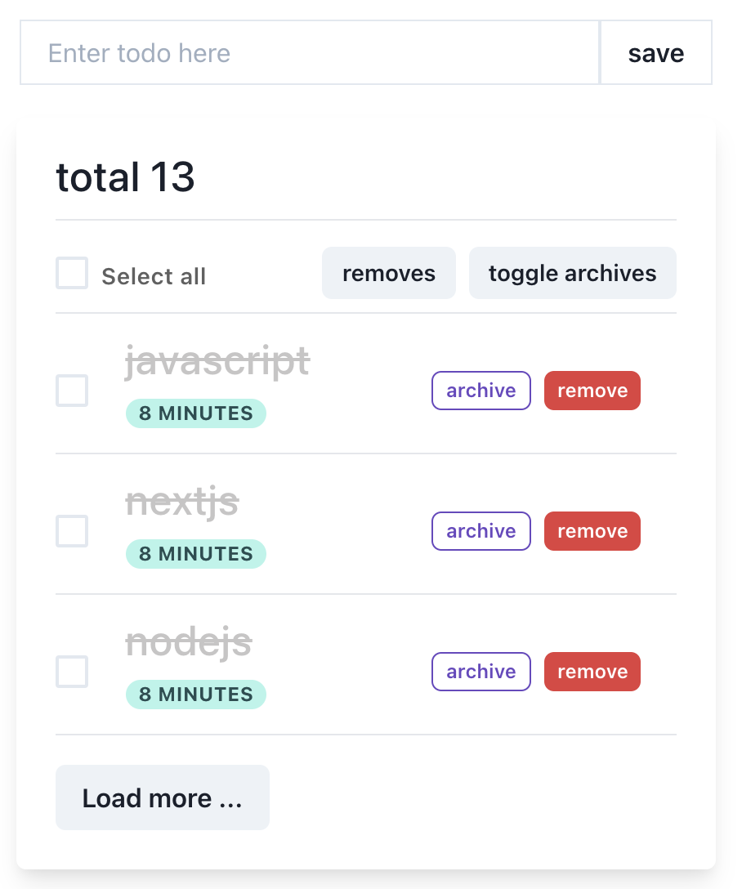

# Tech Stack

- Next js
- GraphQL
- Auth0

---

https://nextjs-graphql-todolist.netlify.app/done,
https://nextjs-graphql-todolist.netlify.app/api/auth/callback,
https://nextjs-graphql-todolist.netlify.app http://localhost:3000/done, https://nextjs-graphql-todolist.netlify.app/login

"dev": "NODE_OPTIONS='--inspect' next dev",

https://dev-9g-fm7pq.us.auth0.com/authorize?client_id=
Qo8sdy711ZNS8T6wpYt85DkJByU3NooC&scope=openid%20profile%20email
&response_type=code&redirect_uri=http%3A%2F%2Flocalhost%3A3000%2Fapi%2Fauth%2Fcallback
&nonce=mh3nMGlA1P1KJJ5i6DstPeScj7CAlPOhCSdvy5YsstM&state=eyJyZXR1cm5UbyI6Imh0dHA6Ly9sb2NhbGhvc3Q6MzAwMCJ9&code_challenge
=YVRjErqsivyMqSA2rwsYhU4lzDNHvCDTHzaGKrbM-Gk&code_challenge_method=S256

-- site github auth0

https://dev-9g-fm7pq.us.auth0.com/u/login?state=hKFo2SA2dDh2UjRTUUN4STZqclNWczZ4TzBNd0FrVFZma3k0MKFur3VuaXZlcnNhbC1sb2dpbqN0aWTZIDhYVDU2TXdWZWducWF6M01ZMVhrOTVVREhKYmJ3WG5Jo2NpZNkgaDlXb1BGazhtWWpFQ3JEeFhGR2U3S3VEa1hlclVSY0Q

